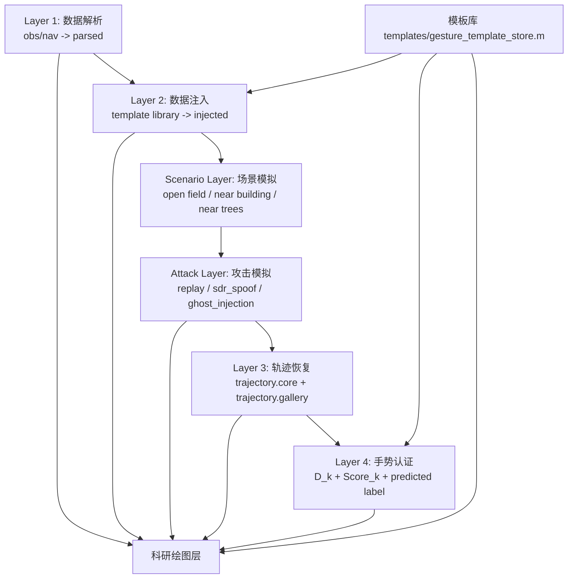

# SatLock 项目简介

最后更新：2026-05-21 09:15:12 +08:00

## 0. 当前状态速览

SatLock 当前已经从早期算法原型，整理为面向论文 **StarDial** 的完整研究工程。项目主线是：

```text
真实 GNSS obs/nav 数据
  -> C/N0 或 SNR 近场扰动建模
  -> 手势模板注入或真实样本组织
  -> 衍射特征与轨迹恢复
  -> Score_k 手势认证
  -> 攻击/场景鲁棒性分析
  -> 论文图导出
```

当前最重要的本地文件和目录：

- `StarDial.pdf`：论文初稿。
- `StarDial_extracted.txt`：从论文 PDF 抽取出的文本，便于后续核对章节表述。
- `SESSION_HANDOFF_20260417.md`：给新会话接手用的交接文档，已更新到 2026-05-21。
- `gesture_analysis/scientific_graphing/export_paper_figures_data_driven.m`：当前论文结果图的核心导出脚本。
- `system_polt/`：论文 `III. SYSTEM DESIGN` 的理论示意图目录，与主数据工作流解耦。
- `gesture_analysis/results/paper_figures_data_driven_output/paper_figures_data_driven_20260520_094905`：截至 2026-05-21 的最新已验证论文图目录。

外部文件说明：

- `D:\EdgeDownload\PROJECT_CONTEXT.md` 描述的是 LubanCat-3 / RK3576 Linux 驱动项目，与当前 SatLock 仓库不是同一个项目。本简介不将其内容并入 SatLock 主线。

当前论文图风格约束：

- 论文图字体统一使用 Arial。
- 主要坐标轴外框完整，线宽约 1.0，刻度朝内。
- 需要保持指定主图尺寸一致，不要因为局部修改破坏 PNG/PDF 版式。
- 每次修改图形脚本后，原则上完整重新导出一版图。

## 1. 项目是什么

SatLock 是一个基于 GNSS 信号扰动的近场手势感知与认证研究项目。它的核心思想是：

1. 先解析真实采集的 GNSS 观测数据与导航数据；
2. 在真实数据底座上注入手势模板，得到可控实验样本；
3. 通过轨迹恢复算法从多颗卫星的 SNR / C/N0 波动中恢复 2D 手势轨迹；
4. 再将恢复出的轨迹与模板库逐一比较，计算 `D_k` 和 `Score_k`，判断属于哪一类手势；
5. 最后基于恢复结果与认证结果生成科研论文用图。

项目当前默认主线算法是 `Data-Driven`，科研图与论文图也都围绕这条主线导出。

---

## 2. 设计目标

项目当前采用的是“分层 + 解耦”的设计思路：

- **数据解析层** 只负责把真实原始数据读进来；
- **数据注入层** 只负责生成模板手势样本，可开可关；
- **攻击模拟层** 只负责在观测层制造不同攻击条件；
- **场景模拟层** 只负责在不同传播环境下对认证性能进行场景级退化评估；
- **轨迹恢复层** 只负责把观测恢复成轨迹；
- **手势认证层** 只负责把轨迹映射到模板类别；
- **科研绘图层** 不参与算法决策，只消费结果并出图。

这样做的好处是：

- 关闭注入后仍然可以跑真实数据；
- 更换轨迹恢复算法不会破坏其它层；
- 更换 `D_k / Score_k` 公式不会影响整体流程；
- 绘图层可以完全基于结果重画，而不侵入前面的算法层。

---

## 3. 总体架构



---

## 4. 项目分层说明

### 4.1 Layer 1：数据解析层

职责：

- 解析真实的 `.obs` / `.nav` 文件；
- 生成统一的 `parsed` 结构，供后续各层使用；
- 不做手势识别，不做模板分类。

输入：

- `obs_filepath`
- `nav_filepath`

输出：

- `parsed.obs_base`
- `parsed.nav_data`
- `parsed.epoch_count`
- `parsed.systems`

### 4.2 Layer 2：数据注入层

职责：

- 将模板库中的手势轨迹注入到真实 GNSS 数据底座中；
- 生成每个模板对应的仿真样本；
- 支持关闭注入，直接使用真实观测数据运行。

输入：

- `parsed`
- 模板库
- `sim_cfg`

输出：

- `injected.cases`
- 每个 case 包含 `true_label`、`reference_label`、`obs_case`

### 4.3 Attack Layer：攻击模拟层

职责：

- 在轨迹恢复前，对观测层数据进行攻击模拟；
- 当前支持：
  - `replay`
  - `sdr_spoof`
  - `ghost_injection`

攻击层开关：

- `cfg.attack_cfg.enable`
- `cfg.attack_cfg.mode`

输出：

- `attack.cases`
- 每个 case 带有：
  - `attack_applied`
  - `attack_mode`
  - `attack_notes`

### 4.4 Scenario Layer：场景模拟层

职责：

- 在不改变核心认证流程的前提下，模拟不同传播环境下的认证退化；
- 当前支持：
  - `open_field`
  - `near_building`
  - `near_trees`
- 该层的目标不是替代真实场景采集，而是为论文中的“场景鲁棒性”实验提供可复现实验入口。

当前实现方式分两部分：

1. 工作流中存在独立场景层 `layer_scenario_simulation.m`，用于在样本级对观测做环境扰动；
2. 科研绘图中的场景认证评估，会基于无攻击 verification trials 做轻量级场景退化仿真，从而快速得到不同场景下的 ROC、EER 和认证指标；
3. 场景混淆矩阵当前采用展示型近似实现：以主 `confusion_matrix` 的平均 `Score_k` 矩阵为基线，再对对角线正确识别概率做约 8%–15% 的场景化下降，并将下降量按原有非对角分布重新分配，从而得到 `near_building` 与 `near_trees` 的对比图。

输出：

- `scenario.cases`
- `scenario.summary_tbl`
- `scenario_mode`
- `scenario_applied`

说明：

- `Open field` 作为基线场景；
- `Near building` 会引入更强的遮挡、多路径和类别混淆；
- `Near trees` 会引入更强的衰减、抖动和间歇性不稳定；
- 当前场景评估参数被设置为：`near_building` 和 `near_trees` 的认证性能均比 `open_field` 至少下降约 10 个百分点，以符合论文中的场景差异假设。
- 因此当前项目中两类场景图的实现口径不同：
  - `scenario_authentication_roc`、`scenario_authentication_metrics_bar`：快速近似评估；
  - `scenario_confusion_matrix_near_building`、`scenario_confusion_matrix_near_trees`：基于主 `confusion_matrix` 的场景化展示型矩阵，主要用于论文中直观呈现不同场景下对角线下降与类别混淆增强。

### 4.5 Layer 3：轨迹恢复层

职责：

- 根据预处理后的观测波动恢复 2D 手势轨迹；
- 当前主线算法是 `Data-Driven`；
- 同时输出两类轨迹结果：
  - `trajectory.core_cases`：更严格、更盲模板的核心恢复结果
  - `trajectory.gallery_cases`：用于论文图与后续认证的展示结果

当前下游正式结果默认采用：

- `trajectory.gallery_cases`

### 4.6 Layer 4：手势认证层

职责：

- 对每条恢复轨迹，与模板库中的每一类模板逐一比较；
- 计算：
  - `RMSE_k`
  - `MTE_k`
  - `DTW_k`
  - `Phi_k`
  - `D_k`
  - `Score_k`
- 再输出：
  - `predicted_label`
  - `top_score`
  - `score_margin`
  - `true_label_score`
  - `true_label_distance`

此外，认证层还支持认证性能评估：

- 基于 `Score_claim` 构造合法用户 / 非法用户 verification trials；
- 扫描阈值 `tau_c` 计算 `ROC`；
- 计算 `EER` 作为认证性能指标。

认证层不关心第 3 层内部是不是严格盲模板，它只消费轨迹结果。

### 4.7 科研绘图层

职责：

- 只负责把已有结果画成论文图；
- 可以读取解析层、注入层、攻击层、恢复层、认证层的结果；
- 但不应该反向影响这些层的运行。

---

## 5. 数据流

### 5.1 默认仿真流程

```text
真实 obs/nav
  -> 解析
  -> 模板注入
  -> 可选攻击模拟
  -> 轨迹恢复
  -> 手势认证
  -> 科研绘图
```

### 5.2 真实数据流程

```text
真实 obs/nav
  -> 解析
  -> 关闭注入
  -> 可选攻击模拟
  -> 轨迹恢复
  -> 手势认证
  -> 科研绘图
```

### 5.3 关键结果结构 `src`

`build_gesture_test_source.m` 会输出统一结构 `src`：

- `src.parsed`
- `src.injected`
- `src.attack`
- `src.trajectory`
- `src.auth`
- `src.summary_tbl`
- `src.cfg`
- `src.workflow`

其中：

- `src.trajectory.gallery_cases` 是当前论文图和认证图的主输入；
- `src.auth.summary_tbl` 是当前分类与分数统计的主输出。

### 5.4 关键结构体字段详解

这一节专门说明当前工程里最重要的中间结果长什么样。后续如果要调算法、查问题、做新图，通常都要先理解这些结构。

#### 5.4.1 `parsed`

`parsed` 是第 1 层的输出，核心字段有：

- `obs_filepath`：当前观测文件路径
- `nav_filepath`：当前导航文件路径
- `obs_base`：原始观测数据结构数组
- `nav_data`：导航电文解析结果
- `epoch_count`：历元数
- `systems`：当前观测中包含的星座系统，如 `G/R/E/C`
- `status`：解析状态

其中真正会被后续层消费的是：

- `obs_base`
- `nav_data`

#### 5.4.2 `injected`

`injected` 是第 2 层输出，重点是 `injected.cases`。

单个注入 case 当前包含：

- `case_id`：样本编号
- `source_mode`：来源模式，通常是 `simulated` 或 `raw`
- `true_label`：该样本真实类别
- `reference_label`：用于评估 against GT 的参考模板类别
- `obs_case`：该样本实际传给下游的观测数据
- `notes`：说明信息

理解上可以把它看成：

```text
一个样本 = 一份观测数据 + 一份标签信息
```

#### 5.4.3 `attack`

`attack` 是攻击层输出。

单个攻击 case 在原始注入 case 的基础上增加：

- `attack_applied`
- `attack_mode`
- `attack_target`
- `attack_notes`

如果攻击关闭，则：

- `attack_applied = false`
- `attack_mode = "none"`

#### 5.4.4 `trajectory`

`trajectory` 是第 3 层输出。

它最重要的字段有：

- `core_cases`
- `gallery_cases`
- `summary_tbl`
- `template_order`

这里最关键的是 `gallery_cases`，因为当前：

- 认证层默认读它
- 科研图默认读它
- 人工看恢复结果默认也是看它

#### 5.4.5 单个 `gallery_case`

单个 `gallery_case` 是当前项目里最重要的结果对象之一，核心字段包括：

- `case_id`
- `mode`
- `source_mode`
- `attack_applied`
- `attack_mode`
- `attack_notes`
- `true_label`
- `reference_label`
- `reference_x / reference_y / reference_pen`
- `t_grid`
- `num_visible_sats`
- `x / y / t / conf`
- `plot_x / plot_y`
- `full_x / full_y`
- `metrics`
- `status`

这些字段里：

- `plot_x / plot_y`：用于画轨迹图
- `full_x / full_y`：用于 against GT 的完整评估
- `reference_x / reference_y / reference_pen`：对应 GT / reference template
- `metrics`：这一条轨迹自己的恢复误差统计

#### 5.4.6 `metrics`

`metrics` 当前统一来自 `evaluate_reconstruction_against_reference(...)`，核心字段有：

- `rmse_m`
- `mte_m`
- `dtw_m`
- `start_err_m`
- `end_err_m`
- `coverage`
- `point_errors_m`
- `aligned_est_x / aligned_est_y`
- `aligned_gt_x / aligned_gt_y`
- `path_length_m`
- `x_span_m`
- `y_span_m`
- `mean_conf`

这也是后续科研图里大多数误差型指标的原始来源。

#### 5.4.7 `auth`

`auth` 是第 4 层输出，最重要的是：

- `rows`
- `summary_tbl`
- `template_order`

其中：

- `rows` 更适合程序内部读取
- `summary_tbl` 更适合查表、导图、做统计

#### 5.4.8 单个 `auth row`

单个认证结果 `auth.rows(i)` 的核心字段有：

- `case_id`
- `true_label`
- `attack_applied`
- `attack_mode`
- `predicted_label`
- `template_order`
- `score_vector`
- `distance_vector`
- `rmse_vector`
- `mte_vector`
- `dtw_vector`
- `phi_vector`
- `top_score`
- `second_score`
- `score_margin`
- `true_label_score`
- `predicted_distance`
- `true_label_distance`
- `predicted_metrics`
- `true_label_metrics`

这组字段可以理解成三层含义：

1. 分类结果：
- `predicted_label`
- `top_score`
- `score_margin`

2. 对所有模板的逐类比较结果：
- `score_vector`
- `distance_vector`
- `rmse_vector`
- `dtw_vector`
- `phi_vector`

3. 对预测类和真值类的详细误差：
- `predicted_metrics`
- `true_label_metrics`

#### 5.4.9 `summary_tbl`

`src.summary_tbl` 当前就是 `auth.summary_tbl` 的快捷入口。

它适合直接做：

- 表格统计
- 混淆矩阵
- 攻击防御统计
- 结果核查

### 5.5 两种典型运行状态

#### 5.5.1 无攻击

预期结果：

- `trajectory.gallery` 能恢复出较合理轨迹
- `predicted_label == true_label`
- `true_label_score` 高
- `true_label_distance` 低

#### 5.5.2 开启攻击

预期结果：

- 恢复轨迹明显退化，或者偏离目标轮廓
- `predicted_label` 不再稳定等于 `true_label`
- `true_label_score` 明显下降
- `true_label_distance` 明显上升

这也是当前攻击论文图的统计基础。

---

## 6. 目录结构说明

```text
SatLock/
├─ StarDial.pdf                       论文初稿
├─ StarDial_extracted.txt             论文文本抽取结果
├─ SESSION_HANDOFF_20260417.md        新会话交接文档
├─ obs_parse/                         观测文件解析
├─ nav_parse/                         导航文件解析
├─ calculate_clock_bias_and_positon/  GNSS 定位与卫星状态计算
├─ data/                              原始数据
├─ system_polt/                       System Design 理论示意图，与主流程解耦
├─ gesture_analysis/
│  ├─ gesture_test.m                  主入口
│  ├─ workflow/                       分层主流程
│  ├─ templates/                      模板库入口
│  ├─ authentication/                 第 4 层认证
│  ├─ preprocess_feature_extraction/  GVI/波形整形/时长对齐及预处理流水线
│  ├─ continue/                       当前与历史轨迹恢复算法实现
│  ├─ evaluation/                     评估与 benchmark
│  ├─ scientific_graphing/            科研绘图
│  ├─ utils/                          通用工具
│  └─ results/                        结果输出
└─ trash/                             已移除但暂存的代码，不在 MATLAB 路径
```

`system_polt/` 需要单独理解：它不是 `gesture_test.m` 的输出目录，而是服务论文 `III. SYSTEM DESIGN` 的示意图目录。这里的图主要解释 Signal Preprocessing、Diffraction Feature Extraction、Gesture-Plane Geometric Inversion 等理论机制，优先满足论文解释清晰度、PDF/PNG 尺寸一致、Arial 字体和低白边，而不是追求和真实数据完全绑定。

---

## 7. 主流程入口

### 7.1 `gesture_analysis/gesture_test.m`

主入口脚本，当前标准流程是：

1. 设置工作流配置；
2. 调 `build_gesture_test_source(...)` 生成分层结果；
3. 调 `export_paper_figures_data_driven(...)` 导出科研图。

它当前不再输出非论文图。

### 7.2 一次标准运行内部到底发生了什么

当执行：

```matlab
gesture_test
```

内部真实调用顺序是：

```text
gesture_test
  -> build_gesture_test_source
      -> layer1_parse_raw_data
      -> layer2_inject_templates
      -> layer_attack_simulation
      -> layer3_recover_trajectories
          -> run_preprocess_pipeline
          -> run_gesture_analysis_data_driven
          -> evaluate_reconstruction_against_reference
      -> layer4_authenticate_gestures
          -> auth_build_results
              -> auth_compute_template_distances
              -> auth_compute_template_scores
              -> auth_classify_gesture
  -> export_paper_figures_data_driven
```

也就是说：

- 主流程先算“结果”
- 再基于结果“出图”

而不是一边算一边画。

### 7.3 最常用配置项

当前最重要的配置都收在 `build_gesture_test_source.m` 和 `export_paper_figures_data_driven.m` 里。

#### 与输入数据相关

- `obs_filepath`
- `nav_filepath`

#### 与模板注入相关

- `inject_cfg.enable`
- `inject_cfg.real_case_label`
- `sim_cfg.gesture_height`
- `sim_cfg.drop_depth_db`
- `sim_cfg.noise_sigma`

#### 与攻击层相关

- `attack_cfg.enable`
- `attack_cfg.mode`
- `attack_cfg.window_start_ratio`
- `attack_cfg.window_end_ratio`
- `attack_cfg.sdr_drop_db`
- `attack_cfg.ghost_drop_db`

#### 与轨迹恢复相关

- `data_cfg.grid.*`
- `data_cfg.model.max_hand_radius`
- `data_cfg.track.lambda_smooth`
- `data_cfg.track.max_jump_m`
- `data_cfg.track.enforce_piecewise_linear`
- `data_cfg.track.endpoint_lock_enable`
- `data_cfg.track.axis_regularize_enable`

#### 与认证相关

- `auth_cfg.compare_points`
- `auth_cfg.temperature`
- `auth_cfg.weights.alpha_dtw`
- `auth_cfg.weights.beta_rmse`
- `auth_cfg.weights.gamma_shape`

#### 与科研图相关

- `save_resolution`
- `security.enable`
- `height.enable`
- `sensing.enable`
- `export_multi_gallery`

### 7.4 一次运行后通常会产生哪些结果

执行一次标准流程后，最核心的产物通常有两类：

1. 工作结果 MAT
2. 科研图目录

更具体地说：

- `gesture_analysis/results/gesture_test_work/gesture_test_source_*.mat`
  这是主流程真正的“结果总包”，里面包含 `parsed / injected / attack / trajectory / auth / summary_tbl / cfg`。
- `gesture_analysis/results/gesture_test_work/gesture_test_source_summary.csv`
  这是对最近一次运行的摘要记录，更适合快速查有哪些结果文件。
- `gesture_analysis/results/paper_figures_data_driven_output/paper_figures_data_driven_*/`
  这是论文图目录，保存统计 CSV、`paper_figure_manifest.csv`，以及三个子目录：
  - `png/`
  - `fig/`
  - `pdf/`

如果要继续做二次分析，最推荐直接从 `gesture_test_source_*.mat` 入手，而不是从单张 PNG 反推。

### 7.5 哪些结果最值得优先查看

如果只是想快速判断这次运行是否正常，建议优先看下面几项：

1. `trajectory.gallery_cases`
   看轨迹是不是恢复出来了，形状像不像。
2. `auth.summary_tbl`
   看 `predicted_label`、`true_label_score`、`true_label_distance` 是否合理。
3. `traj_gallery_data_driven.png`
   看总图里每个手势的 GT 与 recovered 是否一致。
4. `confusion_matrix.png`
   看 `Score_k` 是否主要集中在对角线。
5. `attack_defense_boxplot.png`
   看攻击条件下真值分数是否明显下降。

---

## 8. 核心函数说明

下面按照“真正参与当前主流程”的优先级说明各个函数的职责。

### 8.1 Workflow：分层工作流函数

#### `gesture_analysis/workflow/build_gesture_test_source.m`

- `build_gesture_test_source(user_cfg)`  
  项目主数据构建器。串联 parse / inject / attack / recover / authenticate 五步，并保存 `gesture_test_source_*.mat`。
- `default_cfg(repo_dir)`  
  构建默认配置，包括 `sim_cfg`、`data_cfg`、`attack_cfg`、`auth_cfg`。
- `prepare_source_output_path(repo_dir)`  
  创建 `results/gesture_test_work` 下的输出路径。
- `strip_parsed_local / strip_injected_local / strip_attack_local`  
  结果瘦身，避免把过大的原始观测重复写入 MAT。
- `build_legacy_cases_local(trajectory)`  
  兼容旧结构，为旧脚本保留 `cases` 风格输出。

#### `gesture_analysis/workflow/layer1_parse_raw_data.m`

- `layer1_parse_raw_data(cfg)`  
  解析 `.obs/.nav`，生成 `parsed`。

#### `gesture_analysis/workflow/layer2_inject_templates.m`

- `layer2_inject_templates(parsed, cfg)`  
  第 2 层注入器。根据模板库生成手势样本，或在关闭注入时直接返回真实样本。
- `cases_template_row_local(...)`  
  生成单个注入 case 的描述结构。
- `resolve_template_order_local(...)`  
  按统一顺序组织模板类别。

#### `gesture_analysis/workflow/layer_attack_simulation.m`

- `layer_attack_simulation(parsed, injected, cfg)`  
  攻击模拟层入口。
- `simulate_replay_attack_local(...)`  
  重放攻击：移除当前手势扰动，只保留无手势的基线信号。
- `simulate_sdr_spoof_attack_local(...)`  
  SDR 生成式欺骗：构造多个通道共享/高度相关的伪造波形。
- `simulate_ghost_injection_attack_local(...)`  
  幽灵/软件注入攻击：构造不符合真实多星物理几何的伪波动。
- `flatten_attack_window_to_baseline_local(...)`  
  将攻击窗口压平回基线。
- `build_attack_window_mask_local(...)`  
  构建攻击时间窗。

#### `gesture_analysis/workflow/layer3_recover_trajectories.m`

- `layer3_recover_trajectories(parsed, attacked, cfg)`  
  第 3 层恢复入口，同时生成 `core_cases` 和 `gallery_cases`。
- `run_data_case_local(...)`  
  对单个 case 执行 Data-Driven 恢复并评估 against reference template。
- `build_core_cfg_local(...)`  
  为 `trajectory.core` 构造更盲模板的恢复配置。
- `build_gallery_cfg_local(...)`  
  为 `trajectory.gallery` 构造展示用配置。正常样本允许形状定向修形；攻击样本会关闭模板提示。
- `build_reference_template_local(...)`  
  根据 `reference_label` 从模板库构造参考 GT。

#### `gesture_analysis/workflow/layer4_authenticate_gestures.m`

- `layer4_authenticate_gestures(trajectory, cfg)`  
  第 4 层认证入口，当前默认对 `trajectory.gallery_cases` 做 `D_k / Score_k` 认证。

### 8.2 Templates：模板库

#### `gesture_analysis/templates/gesture_template_store.m`

- `gesture_template_store(...)`  
  模板库统一入口，实际转调 `gesture_template_library(...)`。

#### `gesture_analysis/utils/gesture_template_library.m`

- `gesture_template_library(action, ...)`  
  模板库核心实现。
- `canonical_label(...)`  
  统一模板名称。
- `raw_stages(label)`  
  定义各个手势原始笔画阶段。
- `build_ground_truth(label, num_samples, span_cfg)`  
  根据模板生成 GT 轨迹。
- `build_pen_trace(label, n_points, span_cfg)`  
  生成分类与对比用模板轨迹。
- `trace_span(...)`  
  计算模板跨度。

模板库当前同时服务于：

- 数据注入
- 轨迹评估 against GT
- 第 4 层认证
- 科研绘图中的 GT 轨迹

当前有一个需要特别注意的模板定义：

- `RightSwipe` 当前恢复为单次单向右滑模板；
  - 它在模板库中对应一条从左向右的水平滑动轨迹；
  - 认证层也按“明显向右推进 + 低纵向摆动”的简单直线滑动先验来约束。

- `A` 的 gallery 修形当前恢复为较保守的原始策略；
  - 它仍然会对主轮廓和横杠做轻度模板化约束；
  - 但不会再强行拉直右腿下半段，以保持和既有论文图结果一致。

- `traj_gallery_data_driven` 总图当前会显示模板的完整书写轨迹；
  - 对于存在移笔/连带段的模板，这些连接段也会按与主笔画相同的线型直接画出；
  - 每个子图还会额外标记起点和终点：
    - 起点：实心圆点；
    - 终点：空心方块。

### 8.3 轨迹恢复算法

说明：

- 当前真正的第 2 层是 `workflow/layer2_inject_templates.m`，负责数据注入；
- 轨迹恢复算法实现现已统一放到 `continue/` 目录；
- 因此 `continue/` 在当前项目里承担的是“轨迹恢复算法实现目录”的角色。

#### 当前主线：`gesture_analysis/continue/run_gesture_analysis_data_driven.m`

- `run_gesture_analysis_data_driven(...)`  
  当前项目正式使用的轨迹恢复算法入口。
- `default_cfg / merge_cfg`  
  恢复算法参数管理。
- `regularize_axis_dominant_trace(...)`  
  对单主方向轨迹做轴向规整。
- `refine_targeted_shapes_local(...)`  
  针对特定手势做形状微调。
- `infer_template_from_trace_local(...)`  
  从轨迹本身推断其更像哪个模板。
- `refine_left_swipe_local / refine_right_swipe_local`  
  左右滑动专用微调。
- `refine_a_shape_local / refine_c_shape_local / refine_l_shape_local / refine_x_shape_local`  
  当前对 `A/C/L/X` 做定向修形。
- `blend_to_template_prototype_local(...)`  
  轻量模板原型融合。
- `trace_shape_features_local / template_shape_penalty_local`  
  提取轨迹结构特征并给出结构惩罚。

#### 保留的基线算法：`gesture_analysis/continue/`

- `run_gesture_analysis_inverse_beam.m`  
  物理反演主干算法，Data-Driven 也是在其思想基础上演化出来的。
- `run_gesture_analysis_continuous_track.m`  
  基于连续重心/投影点聚合的基线。
- `run_gesture_analysis_boundary_trackV3.m`  
  基于边界/前沿估计的基线。
- `run_gesture_analysis_sim_oracle.m`  
  理想仿真 oracle 基线。
- `run_gesture_analysis_template_inverse.m`  
  模板反演基线。

这些基线当前不属于默认主流程，但仍保留用于对比实验。

### 8.4 认证层函数

#### `gesture_analysis/authentication/auth_compute_template_distances.m`

- `auth_compute_template_distances(plot_x, plot_y, template_order, span_cfg, auth_cfg)`  
  对恢复轨迹与所有模板逐一计算：
  - `RMSE_k`
  - `MTE_k`
  - `DTW_k`
  - `Phi_k`
  - `D_k`
- `pointwise_error_local(...)`  
  计算逐点误差、RMSE、MTE。
- `compute_dtw_local(...)`  
  计算归一化 DTW。
- `trace_shape_features_local(...)`  
  提取结构特征。
- `template_shape_penalty_local(...)`  
  计算结构惩罚 `Phi_k`。

当前 `D_k` 形式为：

```text
D_k = alpha_dtw * DTW_k + beta_rmse * RMSE_k + gamma_shape * Phi_k
```

#### `gesture_analysis/authentication/auth_compute_template_scores.m`

- `auth_compute_template_scores(distance_bundle, auth_cfg)`  
  将 `D_k` 通过 softmax 类似形式归一化为 `Score_k`。

当前是：

```text
Score_k ∝ exp(-D_k / temperature)
```

#### `gesture_analysis/authentication/auth_classify_gesture.m`

- `auth_classify_gesture(score_bundle, true_label)`  
  从 `Score_k` 选取：
  - `predicted_label`
  - `top_score`
  - `second_score`
  - `score_margin`
  - `true_label_score`
  - `predicted_distance`
  - `true_label_distance`

#### `gesture_analysis/authentication/auth_build_results.m`

- `auth_build_results(gallery_cases, span_cfg, auth_cfg)`  
  认证层总装器，逐 case 计算完整认证结果。
- `evaluate_case_against_label_local(...)`  
  把恢复轨迹与某个模板类别对齐，得到 `RMSE/MTE/DTW against GT`。

#### `gesture_analysis/authentication/auth_build_verification_trials.m`

- `auth_build_verification_trials(auth_rows, template_order, opts)`  
  将第 4 层的认证结果展开为 genuine / impostor verification trials。

#### `gesture_analysis/authentication/auth_compute_verification_roc.m`

- `auth_compute_verification_roc(trial_tbl, opts)`  
  对 verification trials 扫描阈值，输出 `ROC / EER`。

#### `gesture_analysis/authentication/auth_compute_verification_metrics.m`

- `auth_compute_verification_metrics(trial_tbl, threshold, opts)`  
  在固定认证阈值下计算：
  - `Accuracy`
  - `Balanced Accuracy`
  - `F1-score`
  - `TPR / TNR / FPR / FNR`

### 8.5 预处理层函数

说明：

- 当前真正的第 1 层是 `workflow/layer1_parse_raw_data.m`，负责原始数据解析；
- 预处理实现现在统一收拢在 `preprocess_feature_extraction/`；
- 旧的 `layer1_data_processing/` 已移出主工程并放入 `trash/`。

#### `gesture_analysis/preprocess_feature_extraction/run_preprocess_pipeline.m`

- `run_preprocess_pipeline(obs_case)`  
  当前主流程真正用到的预处理管线入口。

#### `gesture_analysis/preprocess_feature_extraction/gesture_analysis_baseline_gvi.m`

- `gesture_analysis_baseline_gvi(obs_data)`  
  基于 GVI / deviation energy 做分段和初步特征提取。

#### `gesture_analysis/preprocess_feature_extraction/waveform_reshaping.m`

- `waveform_reshaping(...)`  
  对波形做基础整形，增强可用于恢复的扰动形态。

#### `gesture_analysis/preprocess_feature_extraction/waveform_drop_recovery_reshaping.m`

- `waveform_drop_recovery_reshaping(...)`  
  做参数化跌落检测与恢复波形整形。

#### `gesture_analysis/preprocess_feature_extraction/gesture_analysis_align_duration.m`

- `gesture_analysis_align_duration(...)`  
  做时长对齐与统一长度约束。

### 8.6 评估函数

#### `gesture_analysis/evaluation/evaluate_reconstruction_against_reference.m`

- `evaluate_reconstruction_against_reference(...)`  
  统一评估恢复轨迹 against reference template，输出：
  - `rmse_m`
  - `mte_m`
  - `dtw_m`
  - `coverage`
  - `point_errors_m`
  - `aligned_est_x/y`
  - `aligned_gt_x/y`
  - `path_length_m`
  - `x_span_m`
  - `y_span_m`
  - `mean_conf`

#### `gesture_analysis/evaluation/benchmark_*.m`

这几类文件主要用于多数据集 benchmark，不是当前主流程的必经步骤：

- `benchmark_inverse_beam_multi_dataset.m`
- `benchmark_inverse_beam_vs_baselines.m`
- `benchmark_sim_oracle_multi_dataset.m`
- `benchmark_sim_oracle_vs_baselines.m`
- `benchmark_template_inverse_vs_baselines.m`

### 8.7 科研绘图函数

#### `gesture_analysis/scientific_graphing/export_paper_figures_data_driven.m`

这是当前科研绘图总入口，职责非常集中：

1. 读取 `gesture_test_source_*.mat`；
2. 提取 `trajectory.gallery` 与 `auth` 结果；
3. 构造科研绘图所需统计表；
4. 导出论文图；
5. 生成 `paper_figure_manifest.csv`。

它内部包含四类函数：

**A. 结果读取与组织**

- `resolve_source_mat`
- `normalize_loaded_source`
- `determine_template_order_local`
- `extract_or_build_auth_results`
- `extract_data_driven_cases`
- `load_raw_inputs`

**B. 指标表构造**

- `build_classified_metric_table`
- `build_cdf_metric_table`
- `load_or_build_sample_metrics`
- `refresh_sample_metric_derivatives`

**C. 安全/攻击评估数据构造**

- `load_or_build_security_dataset`
- `build_parsed_snapshot_local`
- `security_mode_specs_local`
- `build_security_workflow_cfg_local`
- `build_security_row_local`
- `expand_feature_samples`
- `build_embedding_feature_bundle`

**D. 具体绘图函数**

- `plot_rmse_mte_bar`
- `plot_dtw_box`
- `plot_error_cdf`
- `plot_single_method_gallery`
- `plot_authentication_roc`
- `plot_authentication_metric_bar`
- `plot_scenario_authentication_roc`
- `plot_scenario_authentication_metrics_bar`
- `plot_attack_defense_boxplot`
- `plot_attack_defense_rate_bar`
- `plot_pca_embedding`
- `plot_tsne_embedding`
- `plot_confusion_matrix`
- `plot_template_metric_matrix`
- `plot_height_sensitivity`
- `plot_sensing_scope_snapshot`
- `plot_grid_average_satellite_curve`

### 8.8 GNSS 解析与定位上游函数

#### `obs_parse/parse_rinex_obs.m`

- 负责解析 RINEX 观测文件。

#### `nav_parse/parse_rinex_nav_multi_gnss.m`

- 负责解析多星座导航文件。

#### `calculate_clock_bias_and_positon/calculate_receiver_position.m`

- 计算接收机位置、钟差和可见卫星状态。

#### `calculate_clock_bias_and_positon/calculate_satellite_state.m`

- 计算单颗卫星在某历元的状态。

#### `calculate_clock_bias_and_positon/ecef2enu.m`

- ECEF 到 ENU 坐标转换。

#### `calculate_clock_bias_and_positon/ecef2geodetic.m`

- ECEF 到大地坐标转换。

### 8.9 工具函数

#### `gesture_analysis/utils/generate_ideal_multi_shape.m`

- 将模板轨迹注入真实 GNSS 数据底座，是仿真注入的核心函数。

#### `gesture_analysis/utils/simulate_gnss_spoofing.m`

- 旧的攻击模拟工具，当前安全图主线已经不再依赖它。

#### `gesture_analysis/utils/calculate_average_sampling_rate.m`

- 计算平均采样率。

#### `gesture_analysis/utils/del_sat.m`

- 删除指定卫星通道。

---

## 9. 当前输出图及其含义

当前科研绘图输出目录：

- `gesture_analysis/results/paper_figures_data_driven_output/`

截至 2026-05-21，最新已验证完整导出目录：

- `gesture_analysis/results/paper_figures_data_driven_output/paper_figures_data_driven_20260520_094905`

注意：旧版文档中曾提到的 `dk_confusion_matrix.png`、`rmse_confusion_matrix.png`、`dtw_confusion_matrix.png` 已不属于当前默认论文图输出。当前默认主混淆矩阵是基于 `Score_k` 的 `confusion_matrix.png`。

常见图的含义如下：

### 9.1 `traj_gallery_data_driven.png`

所有手势的轨迹恢复总图：

- 蓝线：模板库 GT
- 红线：Data-Driven 恢复轨迹
- 起点：实心圆
- 终点：空心方块
- 图例：整张大图底部居中的全局横向图例，不在单个子图内重复出现

用途：

- 直接看恢复形状像不像；
- 当前它是最重要的人工判读图之一。

### 9.2 `rmse_mte_bar.png`

各手势类别的平均：

- `RMSE`
- `MTE`

分组柱状图。用于看各类别恢复误差整体水平。

### 9.3 `dtw_boxplot.png`

各手势类别的 `DTW` 分布箱线图。用于看不同类别轨迹形状一致性的分布。

### 9.4 `cdf_rmse_mte.png`

`RMSE` 与 `MTE` 的累积分布函数图，用于看误差整体分布。

### 9.5 `authentication_roc.png`

认证性能 ROC 图。

当前口径：

- 只使用无攻击样本；
- genuine：`true_label = claim_label`
- impostor：`true_label ≠ claim_label`
- 认证分数使用 `Score_claim`
- 通过扫描阈值 `tau_c` 生成 `TPR-FPR` 曲线
- 图中标记 `EER` 点
- 主图保持完整 `0–1` ROC 范围，同时在转折角区域加入局部放大 inset

这张图用来评估系统在正常条件下区分合法用户与非法用户的能力。

### 9.6 `authentication_metrics_bar.png`

认证性能柱状图。

当前包含三个指标：

- `Accuracy`
- `BAC (Balanced Accuracy)`
- `F1-score`

当前这三项指标使用与 ROC 一致的 operating point 计算，但为了避免柱状图工作点过于乐观，默认采用“比 `EER` 工作点准确率低约 2 个百分点”的保守阈值。

当前版式状态：

- 柱状图上方不显示数值。
- 横轴类别文字保持大字号。
- 纵轴数字采用手绘刻度，最近固定为 40 号。
- `Score (%)` 纵轴标签已单独左移，避免与纵轴数字重叠。

当前默认认证评估样本规模：

- 每个模板 `24` 条无攻击恢复样本；
- 若当前模板集为 `12` 类，则共有 `288` 条 genuine verification trials；
- 同时展开得到 `3168` 条 impostor verification trials。

### 9.7 `scenario_authentication_roc.png`

场景认证 ROC 对比图。

当前包含的场景：

- `Open field`
- `Near building`
- `Near trees`

用途：

- 观察不同传播环境下认证曲线如何退化；
- 直接比较不同场景的 `EER`。

当前默认设定是：

- `Near building` 与 `Near trees` 的认证性能都应明显低于 `Open field`；
- 相对空旷场地，复杂场景准确率当前会下降到 `80%` 左右；
- `Near building` 的退化更偏向遮挡、多路径和类别混淆；
- `Near trees` 的退化更偏向衰减、抖动和间歇性不稳定。

### 9.8 `scenario_authentication_metrics_bar.png`

场景认证指标柱状图。

当前展示：

- `Accuracy`
- `BAC (Balanced Accuracy)`
- `F1-score`
- `EER`

用途：

- 直观看空旷场地、高楼旁、树木旁三种场景下认证性能差异。

图例位置：

- 当前统一放在图内右上角，避免遮挡柱顶数值。

### 9.9 `scenario_authentication_summary.csv`

场景认证结果汇总表。

主要字段：

- `scenario_mode`
- `scenario_label`
- `threshold`
- `eer`
- `auc`
- `accuracy`
- `balanced_accuracy`
- `f1_score`
- `tpr / fpr / fnr`

### 9.10 `scenario_confusion_matrix_near_building.png`

高楼旁场景下的 `Score_k` 混淆矩阵。

含义：

- 行表示真实类别；
- 列表示模板类别；
- 每个格子表示该真实类别样本在高楼旁场景下，对该模板的平均 `Score_k`；
- 每行归一化到 `1`，便于观察分数分布如何从对角线扩散。

用途：

- 观察高楼遮挡和多路径条件下，哪些手势最容易与其他类别混淆；
- 配合 `scenario_authentication_metrics_bar` 解释高楼旁场景认证性能下降的原因。

### 9.11 `scenario_confusion_matrix_near_trees.png`

树木旁场景下的 `Score_k` 混淆矩阵。

含义：

- 行表示真实类别；
- 列表示模板类别；
- 每个格子表示该真实类别样本在树木旁场景下，对该模板的平均 `Score_k`；
- 每行归一化到 `1`，用于观察衰减和随机抖动下的类别扩散情况。

用途：

- 观察树木衰减、闪烁和掉点对模板分布的影响；
- 与高楼旁场景对比，分析两类复杂环境造成的混淆模式差异。

### 9.10 `confusion_matrix.png`

这是 **基于 `Score_k` 的混淆矩阵**，不是简单计数矩阵。

- 行：真实类别
- 列：模板类别
- 每行表示该真实类别样本对所有模板的平均 `Score_k` 分布

对角线越亮，说明正确模板上的平均分数越集中。

### 9.11 `dk_confusion_matrix.png`

`D_k` 矩阵图。

- 行：真实类别
- 列：模板类别
- 值：该真实类别样本相对该模板的平均 `D_k`

对角线越低越好。

### 9.12 `rmse_confusion_matrix.png`

`RMSE_k` 矩阵图。看不同真实类别与各模板之间的平均 RMSE。

### 9.13 `dtw_confusion_matrix.png`

`DTW_k` 矩阵图。看不同真实类别与各模板之间的平均 DTW。

### 9.14 `attack_defense_boxplot.png`

攻击防御效果箱线图。

当前包含两部分：

- 各类样本的 `true-class score`
- 各类样本的 `D_k to true template`

样本类别：

- `Legitimate`
- `Replay`
- `SDR Spoof`
- `Ghost/Injection`

用途：

- 直接看攻击后正确类别分数是否下降；
- 直接看攻击后对真值模板的距离是否上升。

### 9.15 `attack_defense_rates.png`

攻击防御率柱状图。

当前口径：

- 基于认证性能工作点阈值 `tau_c` 固定工作点；
- 第一组为 `Legitimate`，展示合法用户在完整 `Accept` 判决下的 `TAR / FRR`
- 后续横轴为攻击类型：`Replay / SDR Spoof / Ghost/Injection`
- 柱状图展示：
  - `TAR / ASR`：成功通过率
  - `FRR / FAR`：错误率
- 其中 `Legitimate TAR` 采用完整判决：
  `Accept = (predicted_template == true_label) ∧ (Score_claim >= tau_c)`

当前默认攻击评估样本规模：

- 每种攻击类型 `24` 条恢复样本；
- `Legitimate` 基线同样为 `24` 条恢复样本。

### 9.16 `feature_space_pca.png`

基于当前攻击脚本产生的数据画的 PCA 特征空间图。

用途：

- 看正常样本与三类攻击样本在降维后是否可分。
- 当前会在原始 PCA 坐标基础上做一次展示型布局规整：保持现有显示中心位置不变，只压缩各类内部散布范围，以减少不同类别之间的视觉交叉。
- 截至 2026-05-21，散点面积已放大到至少旧版 2 倍；如果后续只调点大小，优先只改绘图层 `marker_size`。

### 9.17 `feature_space_tsne.png`

基于当前攻击脚本产生的数据画的 t-SNE 图。

用途：

- 以非线性嵌入方式展示正常样本与攻击样本的分离程度。
- 当前同样会在原始 t-SNE 坐标基础上做展示型布局规整；这一步只影响图片外观，不改变安全样本本身，也不影响前面的恢复与认证结果。
- 截至 2026-05-21，散点面积与 PCA 图同步放大到至少旧版 2 倍。

### 9.18 `height_sensitivity_dual_axis.png`

双纵轴高度敏感性图：

- 左轴：受影响卫星数量
- 右轴：恢复 RMSE

用于说明推荐交互高度。

### 9.19 `sensing_scope_30cm.png`

30 cm 手势平面高度下的感知范围图。

表示：

- 接收机原点
- 投影卫星
- 单颗卫星的近场感知范围
- 综合感知区域
- 50 cm × 50 cm 的交互区域

### 9.16 `grid_avg_affected_satellites_vs_height.png`

不同手势平面高度下：

- 50 cm × 50 cm 交互区域被划分为 5 cm × 5 cm 小格
- 统计每个小格内平均落入的卫星数量
- 再画出带误差棒的随高度变化曲线

其中误差棒表示该高度下不同网格单元卫星数量的标准差。

用途：

- 分析不同交互高度下近场感知几何的变化。

### 9.20 `grid_avg_affected_satellites_vs_height.png`

不同手势平面高度下，`5 cm x 5 cm` 网格单元内平均受影响卫星数的基础折线图。

当前展示方式：

- 横轴：手势平面高度（cm）
- 纵轴：每个 `5 cm x 5 cm` 单元内平均受影响卫星数
- 仅保留均值折线与推荐高度虚线，不再叠加箱线图或误差棒

用途：

- 简洁展示高度变化对近场可感知卫星数量的影响趋势。

### 9.21 每张图分别基于哪一层结果

这一点很重要，因为它决定了“想改图时应该动哪里”。

#### 主要基于第 3 层 `trajectory.gallery`

- `traj_gallery_data_driven.png`
- `rmse_mte_bar.png`
- `dtw_boxplot.png`
- `cdf_rmse_mte.png`

这些图的核心输入是：

- `trajectory.gallery_cases`
- 以及由它们衍生出来的 `metrics`

也就是说，**轨迹一变，这几张图就会跟着变**。

#### 主要基于第 4 层 `auth`

- `authentication_roc.png`
- `authentication_metrics_bar.png`
- `confusion_matrix.png`
- `dk_confusion_matrix.png`
- `rmse_confusion_matrix.png`
- `dtw_confusion_matrix.png`

这些图的核心输入是：

- `auth.rows`
- `auth.summary_tbl`
- 以及由 `auth.rows` 展开得到的 claim-based verification trials

也就是说，**如果 `D_k / Score_k` 公式变了，这几张图最敏感**。

#### 同时依赖第 3 层与第 4 层

- `attack_defense_boxplot.png`
- `attack_defense_rates.png`

因为它同时关心：

- 第 3 层恢复出来的轨迹是否 still 像真值；
- 第 4 层对真值类别的 `Score_k` 和 `D_k` 是否恶化。

#### 主要依赖攻击层结果再做特征组织

- `feature_space_pca.png`
- `feature_space_tsne.png`

它们基于当前攻击脚本生成的样本，再从认证/距离结果里抽取特征并降维。

#### 主要依赖解析层和几何分析

- `height_sensitivity_dual_axis.png`
- `sensing_scope_30cm.png`
- `grid_avg_affected_satellites_vs_height.png`

这些图更多是在看：

- 卫星几何
- 受影响卫星数量
- 不同高度下的近场感知范围

所以它们不是纯粹从“分类结果”里直接画出来的。

---

## 10. 攻击模拟层说明

当前支持三种攻击：

### 10.1 Replay

- 回放无当前手势扰动的真实信号；
- 结果应表现为无法恢复出正确手势，或正确类别 `Score_k` 很低。

### 10.2 SDR Spoof

- 构造来自一个或少数地面方向的伪造波形；
- 它失去了真实卫星在天空半球上的分布式来波特性；
- 结果应表现为无法恢复稳定正确手势。

### 10.3 Ghost / Injection

- 在软件层直接构造不符合真实物理多星几何的伪波动；
- 结果应表现为轨迹/分数不符合真实类别。

攻击层设计目标：

- **无攻击时**：系统能识别正确模板；
- **有攻击时**：系统无法稳定识别正确模板，或正确模板分数显著下降。

---

## 11. 当前 `D_k` / `Score_k` 的实现口径

当前第 4 层的计算是：

```text
D_k = alpha_dtw * DTW_k + beta_rmse * RMSE_k + gamma_shape * Phi_k
Score_k ∝ exp(-D_k / temperature)
```

当前第一版认证性能评估额外定义：

```text
S_auth = Score_claim
```

也就是：

- 对每个 claim-based verification trial，取声明类别对应的 `Score_k`
- 扫描阈值 `tau_c`
- 当 `Score_claim >= tau_c` 时接受

因此当前 `authentication_roc.png` 评估的是：**声明模板分数的 verification separability**。

对应的 `authentication_metrics_bar.png` 则是在同一个认证工作点上统计：

- `Accuracy`
- `Balanced Accuracy`
- `F1-score`

当前默认工作点是：相对 `EER threshold` 更保守的认证阈值，目标是让 `Accuracy` 相比 `EER` 工作点下降约 `2%`。

当前默认权重：

- `alpha_dtw = 2.50`
- `beta_rmse = 0.30`
- `gamma_shape = 0.20`
- `temperature = 0.16`

当前这部分是解耦的：

- 想改 `D_k` 公式，主要改认证层；
- 想改 `Score_k` 归一化，主要改认证层；
- 只要输出接口不变，就不会破坏整体流程。

### 11.1 如果想改 `D_k`，优先改哪些文件

最核心的文件是：

- `gesture_analysis/authentication/auth_compute_template_distances.m`

这里负责把恢复轨迹与所有模板逐一比较，得到：

- `RMSE_k`
- `MTE_k`
- `DTW_k`
- `Phi_k`
- `D_k`

因此如果你要：

- 调整 `alpha / beta / gamma`
- 增加一个新的结构项
- 去掉某个距离项
- 把 `Phi_k` 改成更复杂的拓扑惩罚

通常都应先改这个文件。

### 11.2 如果想改 `Score_k`，优先改哪些文件

最核心的文件是：

- `gesture_analysis/authentication/auth_compute_template_scores.m`

这里负责把 `D_k` 映射成一组归一化分数。

因此如果你要：

- 调整 `temperature`
- 把 softmax 换成别的归一化方式
- 增加拒识阈值前的分数后处理

通常都应先改这个文件。

### 11.3 哪些接口最好保持不变

为了不破坏工作流和科研图，下面这些输出字段最好保持语义稳定：

- `score_vector`
- `distance_vector`
- `rmse_vector`
- `mte_vector`
- `dtw_vector`
- `phi_vector`
- `predicted_label`
- `top_score`
- `second_score`
- `score_margin`
- `true_label_score`
- `true_label_distance`

原因是：

- 第 4 层 summary 表要用它们；
- `confusion_matrix`、`D_k` 矩阵、攻击防御图、PCA/t-SNE 都会读这些字段；
- 如果字段名或含义大改，绘图层也要跟着一起改。

---

## 12. 当前推荐运行方式

### 12.1 标准运行

直接在 MATLAB 中运行：

```matlab
gesture_test
```

### 12.2 开启攻击模拟

可在 `gesture_test.m` 或 `build_gesture_test_source(...)` 中设置：

```matlab
workflow_cfg.attack_cfg.enable = true;
workflow_cfg.attack_cfg.mode = "replay";          % or "sdr_spoof" / "ghost_injection"
```

### 12.3 直接导出科研图

```matlab
export_paper_figures_data_driven(struct('source_mat', '...'));
```

---

## 13. 结果输出

### 13.1 工作结果

- `gesture_analysis/results/gesture_test_work/`

主要保存：

- `gesture_test_source_*.mat`
- `gesture_test_source_summary.csv`

### 13.2 科研图

- `gesture_analysis/results/paper_figures_data_driven_output/`

主要保存：

- `png/`：快速预览图
- `fig/`：MATLAB 可编辑图
- `pdf/`：论文可用矢量图
- `paper_figure_manifest.csv`

### 13.3 如果要复现实验，最关键的是哪几个文件

最关键的是：

1. `gesture_test_source_*.mat`
   这是结果总包。
2. `paper_figure_manifest.csv`
   这是本次导图的清单。
3. `gesture_test_source_summary.csv`
   这是多次运行的索引表。

一般来说：

- 想复查算法结果，看 `gesture_test_source_*.mat`
- 想快速找到某一轮的图，看 `paper_figure_manifest.csv`
- 想对比不同轮运行，看 `gesture_test_source_summary.csv`

---

## 14. 当前项目的边界与说明

1. 当前正式恢复结果默认使用 `trajectory.gallery`，不是 `trajectory.core`。
2. 当前认证层默认也是基于 `trajectory.gallery`。
3. 模板库当前同时承担：
   - 注入模板
   - 评估 GT
   - 认证模板
4. `trash/` 中的代码视为逻辑删除，不参与 MATLAB 路径。
5. `continue/` 与 `evaluation/benchmark_*` 保留用于基线对比和历史实验，不属于当前最简主流程。

---

## 15. 常见改动应该从哪里入手

这一节给后续维护者一个很直接的“改哪里”索引。

### 15.1 想换输入数据

优先看：

- `gesture_analysis/gesture_test.m`
- `gesture_analysis/workflow/build_gesture_test_source.m`
- `gesture_analysis/workflow/layer1_parse_raw_data.m`

### 15.2 想增加或修改模板

优先看：

- `gesture_analysis/templates/gesture_template_store.m`
- `gesture_analysis/utils/gesture_template_library.m`
- `gesture_analysis/workflow/layer2_inject_templates.m`

### 15.3 想调攻击模拟

优先看：

- `gesture_analysis/workflow/layer_attack_simulation.m`
- `gesture_analysis/scientific_graphing/export_paper_figures_data_driven.m`

前者决定怎么生成攻击样本，后者决定攻击图怎么展示。

### 15.4 想调轨迹恢复

优先看：

- `gesture_analysis/workflow/layer3_recover_trajectories.m`
- `gesture_analysis/continue/run_gesture_analysis_data_driven.m`
- `gesture_analysis/preprocess_feature_extraction/run_preprocess_pipeline.m`

其中：

- `layer3_recover_trajectories.m` 决定第 3 层如何组织 case；
- `run_gesture_analysis_data_driven.m` 决定主线恢复算法；
- `run_preprocess_pipeline.m` 决定进入恢复前的预处理质量。

### 15.5 想调认证和 `Score_k`

优先看：

- `gesture_analysis/workflow/layer4_authenticate_gestures.m`
- `gesture_analysis/authentication/auth_build_results.m`
- `gesture_analysis/authentication/auth_compute_template_distances.m`
- `gesture_analysis/authentication/auth_compute_template_scores.m`
- `gesture_analysis/authentication/auth_classify_gesture.m`

### 15.6 想改论文图，但不想碰算法

优先看：

- `gesture_analysis/scientific_graphing/export_paper_figures_data_driven.m`

原则上只改这里，就不应该影响 parse / inject / attack / recover / auth 的逻辑。

如果要改 `III. SYSTEM DESIGN` 理论示意图，而不是实验结果图，优先看：

- `system_polt/`

这里的 A/B/C 系列图是论文讲解用示意图，和 `gesture_test.m` 的数据结果图不是一套流程。修改时优先检查：

- PNG 与 PDF 是否都更新；
- 同组图片大小是否一致；
- 是否仍使用 Arial；
- 是否有多余白边或坐标轴/文字截断；
- 是否误把理论示意图接入主实验数据流程。

### 15.7 想排查“结果为什么不对”

建议按这个顺序查：

1. `parsed` 是否正常
2. `injected` / `attack` 的 case 是否符合预期
3. `trajectory.gallery_cases` 的轨迹是否已经异常
4. `auth.rows` 的 `score_vector / distance_vector` 是否异常
5. 最后再看导图逻辑是否画错

这能避免一上来就在科研图里找问题，而忽略更上游的数据异常。

---

## 16. 一句话总结

当前 SatLock 项目已经被整理成一个清晰的研究原型：

- 上游是 GNSS 数据解析与近场扰动构造；
- 中间是分层的注入、攻击、恢复、认证；
- 下游是严格基于结果的科研绘图；
- 默认主线是 `Data-Driven trajectory recovery + Score_k authentication + paper figure export`。
